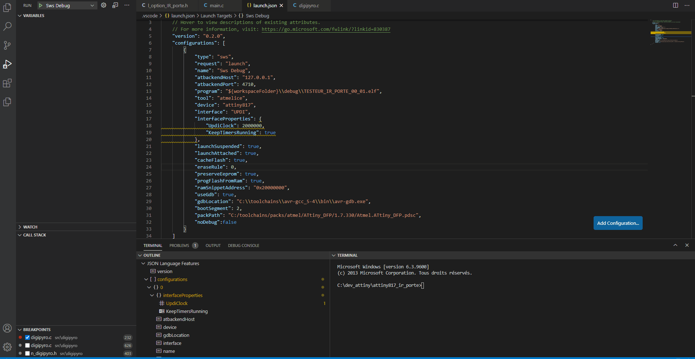

# SWS Extension

SWS Debugger est une extension VSCode permettant de debugger des systèmes embarqués basés sur des micro-contrôleurs Atmel (ATMega, AVR, ATtiny, ...). L'idée de base de cette extension est d'avoir un seul outil, pour le developpement firmware, intégré à notre éditeur: VSCode.\
Elle permettrait de developper des nouveaux firmwares sans dépendances avec des IDEs au fonctionnement parfois flous. De plus, il est très difficile (voir impossible) d'utiliser Atmel Studio 7 pour une session de debug avec des fichiers sources externes. Enfin il sera plus aisé de migrer vers des nouveaux microcontrôleurs tel que l'avr128da48, l'attiny817 et de figer leurs dépendances (version avr-gcc, version du pack).

## Nouveau makefile

## Paramètres
| Paramètre    | Description                                             |
| :----------- | :------------------------------------------------------ |
| CORE         | Micro-contrôleur cible                                  |
| F_CPU        | Fréquence du CPU en Hz                                  |
| INTERFACE    | Interface de programmation (UPDI, JTAG, ...)            |
| PACK         | Nom du dossier contenant le pack                        |
| PACK_VERSION | Numéro de version du pack atmel                         |
| TARGET       | Projet swing (IR_3D, IR_PORTE, ...)                     |
| TOOL         | Outil de programmation (atmelice, avrdragon, nedbg,...) |
| internal     | Laisser SWS démarrer ATBackend                          |
| Port         | Port de communication entre ATBackend et SWS            |

## Commandes de base:
Ces commandes de base sont gérées par le makefile.  


| Commande      | key        | Description                                             |
| :------------ | :--------- | :------------------------------------------------------ |
| make -s all   | ctrl+alt+b | Compile les fichiers source et génère le binaire (.hex) |
| make -s flash | ctrl+alt+f | Flash le microcontrôleur donné en paramètres            |
| make -s clean | ctrl+alt+c | Supprime les objets et binaires dans out                |

  
# SWS Debugger
## Exemples d'utilisation

## Configuration typique (launch.json)
Avant de pouvoir débugger avec l'extension il vous faudra une configuration contenu dans un fichier nommé launch.json dans le dossier .vscode

Si ce fichier n'existe pas il est automatiquement créer en passant par l'onglet "Run and Debug" et en cliquant sur "créer un fichier launch.json" ensuite il vous faudra choisir l'environnement de débug: choisissez "C (AVR-GDB)". Le fichier sera automatiquement généré. La plupart des paramètres n'ont pas besoin d'être modifiés: ils sont liés aux settings que vous avez rentrés pour l'extension SWS, libre à vous de les modifier.

Si un launch.json existe déjà et qu'aucune configuration ne correspond à "C (AVR-GDB)" cliquer sur le bouton "ajouter une configuration" dans le fichier.

```JSON
{
    "type": "sws",
    "request": "launch",
    "name": "Sws Debug",
    "program": "${workspaceFolder}\\debug\\TESTEUR_IR_PORTE_00_01.elf",
    "tool": "atmelice",
    "device": "attiny817",
    "interface": "UPDI",
    "interfaceProperties": {
        "UpdiClock": 2000000,
        "KeepTimersRunning": true
    },
    "launchSuspended": true,
    "launchAttached": true,
    "cacheFlash": true,
    "eraseRule": 0,
    "preserveEeprom": true,
    "progFlashFromRam": true,
    "ramSnippetAddress": "0x20000000",
    "useGdb": true,
    "gdbLocation": "C:\\toolchains\\avr-gcc_5-4\\bin\\avr-gdb.exe",
    "bootSegment": 2,
    "packPath": "C:/toolchains/packs/atmel/ATtiny_DFP/1.2.56/Atmel.ATtiny_DFP.pdsc",
    "noDebug": true
}
```
### Lancer une session de debug
Une fois votre configuration paramétrée cliquez sur le bouton play ou F5 pour démarrer votre session de débug, comme le montre le GIF ci-dessous.

Au démarrage l'éxécution du programme sera directement stoppée au début du main.



## Description des paramètres:

| Paramètre           | Description                                                  |
| :------------------ | :----------------------------------------------------------- |
| type                | Type de la session de debug, laisser sws                     |
| request             | Laisser launch pour lancer une session de debug "sws"        |
| name                | Nom de la session affiché dans VSCode                        |
| program             | Binaire à debugger (.elf)                                    |
| tool                | Outil de programmation (atmelice, avrdragon, nedbg,...)      |
| device              | Micro-contrôleur (attiny817, avr128da48, atmega644p)         |
| interface           | Interface de programmation (UPDI, JTAG, SWD, ...)            |
| interfaceProperties | Propriétés de l'interface de programmation                   |
| InterfaceClock      | Frequence de l'interface de programmation (Hz),              |
| launchSuspended     | Si vrai arrete l'exécution à l'entrée du main                |
| launchAttached      | TODO                                                         |
| cacheFlash          | TODO                                                         |
| preserveEeprom      | Préserve l'eeprom lorsque vous demarrez une session de debug |
| progFlashFromRam    | TODO                                                         |
| ramSnippetAddress   | TODO                                                         |
| useGdb              | Laisser à True, car debug sans gdb impossible pour le moment |
| gdbLocation         | Chemin vers GDB                                              |
| bootSegment         | Préserve l'eeprom lorsque vous demarrez une session de debug |
| packPath            | Chemin vers le pack atmel (.pdsc) du mico-contrôleur         |

Certain microcontroleur, comme l'atmega644, ne possède pas de pack c'est une nouveauté pour donner des détails sur l'architecture mémoire du micro.

# Release Notes

## 0.0.1
Implémentation des commandes de base de l'extension: compiler, programmer.

### 1.0.0
Création du "debug adapter" permettant de debugger n'importe quel microcontrôleur Atmel.
Le DA permet de communiquer avec ATBackend afin de connaitre l'état du microcontroleur durant l'exécution d'un processus par ce dernier.

Cette extension vous permet de:
* Mettre en pause l'éxécution du processus sur l'AVR
* Poser des points d'arrêt dans votre fichier source (.c)
* Avancer step by step dans le programme
* Avancer jusqu'à la fin d'une fonction
* Afficher les appels à la stack dans l'espace "call stack"
* Lire et afficher les registres dans l'espace "variables"
* Voir les variables locales de chaque stack frame
* Afficher chaque champ d'une structure
* Suivre l'évolution d'une variable globale dans l'espace "watch"