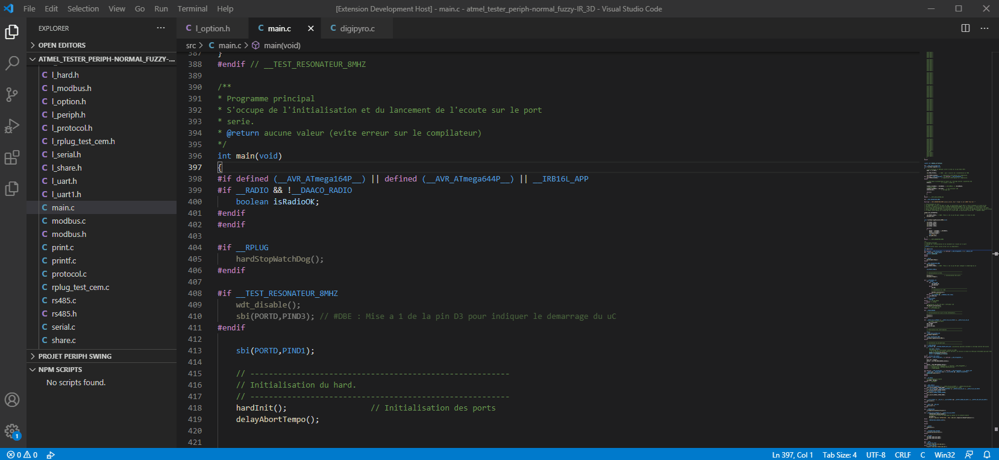
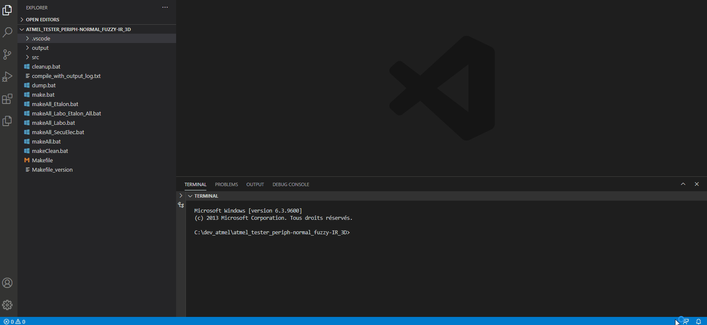

# SWS Extension

SWS permet de debugger des systèmes embarqués basés sur des micro-contrôleurs AVR (ATMega, AVR-Dx, ATtiny, ...). L'objectif de cette extension est d'aider au developpement sur AVR tout en gardant le contrôle sur son environnement de travail. En effet, il vous faudra choisir votre compilateur, créer votre Makefile ...

## Controle de son environnement de travail
ASF7 est un outil complexe où il est difficile de figer son environnement de travail. En effet, il peut y avoir des mis-à-jour des toolchains, des packs, le makefile est généré dynamiquement...
VSCode est seulement un editeur de texte qui ne vous mache pas le travail. Cela demande plus de connaissances mais vous contrôlerez totalement votre environnement de travail. Vos nouveaux firmwares seraient developpés sans dépendances et sans inconnues. Donc il sera plus aisé de migrer vers des nouveaux microcontrôleurs AVR ainsi que de figer leurs versions d'AVR-GCC, du pack ou du makefile.

## Debugger
Utiliser ASF7 pour débugger un programme extérieur à l'IDE s'avère très compliqué. C'est pourquoi cette extension prend tout son sens. En effet, elle permet de débugger des programmes pour des cibles AVR même s'ils sont développés extérieurement.

## Nouveau makefile

## Paramètres
| Paramètre    | Description                                             |
| :----------- | :------------------------------------------------------ |
| CORE         | Micro-contrôleur cible                                  |
| F_CPU        | Fréquence du CPU en Hz                                  |
| INTERFACE    | Interface de programmation (UPDI, JTAG, ...)            |
| PACK         | Nom du dossier contenant le pack                        |
| PACK_VERSION | Numéro de version du pack atmel                         |
| TARGET       | Projet swing (IR_3D, IR_PORTE, ...)                     |
| TOOL         | Outil de programmation (atmelice, avrdragon, nedbg,...) |
| internal     | Laisser SWS démarrer ATBackend                          |
| Port         | Port de communication entre ATBackend et SWS            |

## Commandes de base:
Ces commandes de base sont gérées par le makefile.  


| Commande      | key        | Description                                             |
| :------------ | :--------- | :------------------------------------------------------ |
| make -s all   | ctrl+alt+b | Compile les fichiers source et génère le binaire (.hex) |
| make -s flash | ctrl+alt+f | Flash le microcontrôleur donné en paramètres            |
| make -s clean | ctrl+alt+c | Supprime les objets et binaires dans out                |

  
# AVR Debugger
## Exemples d'utilisation

## Configuration typique (launch.json)
Avant de pouvoir débugger avec l'extension il vous faudra une configuration contenu dans un fichier nommé launch.json situé dans le dossier .vscode.

Si ce fichier n'existe pas il est automatiquement créé en passant par l'onglet "Run and Debug" et en cliquant sur "créer un fichier launch.json" ensuite il vous faudra choisir l'environnement de débug `"C (AVR-GDB)"`. Le fichier sera automatiquement généré. La plupart des paramètres n'ont pas besoin d'être modifiés: ils sont liés aux settings que vous avez rentrés pour l'extension SWS, libre à vous de les modifier.

Si un launch.json existe déjà et qu'aucune configuration ne correspond à `"C (AVR-GDB)"` cliquer sur le bouton `"ajouter une configuration"` dans le fichier.

Le JSON ci-dessous est un exemple de configuration.

```JSON
{
    "type": "sws",
    "request": "launch",
    "name": "Sws Debug",
    "program": "${workspaceFolder}\\debug\\TESTEUR_IR_PORTE_00_01.elf",
    "tool": "atmelice",
    "device": "attiny817",
    "interface": "UPDI",
    "interfaceClock": 500000,
    "launchSuspended": true,
    "launchAttached": true,
    "cacheFlash": true,
    "eraseRule": 0,
    "preserveEeprom": true,
    "progFlashFromRam": true,
    "ramSnippetAddress": "0x20000000",
    "useGdb": true,
    "gdbLocation": "C:\\toolchains\\avr-gcc_5-4\\bin\\avr-gdb.exe",
    "bootSegment": 2,
    "packPath": "C:/toolchains/packs/atmel/ATtiny_DFP/1.2.56/Atmel.ATtiny_DFP.pdsc",
    "noDebug": true
}
```
### Lancer une session de debug
Une fois votre configuration paramétrée, cliquez sur le bouton `play` ou `F5` pour démarrer votre session de débug. 
Le GIF ci-dessous montre une session de débug.
Le fichier elf est d'abord programmé et un spinner indique la progression. Ensuite le programme est exécuté puis mis en pause au début de la fonction `main()`. Enfin le fichier source s'affiche et vous pouvez naviguer avec les commandes de debug classiques (run, step in, ...)



Vous êtes maintenant en mesure de débugger votre système.

## Description des paramètres:

| Paramètre         | Description                                                  |
| :---------------- | :----------------------------------------------------------- |
| type              | Type de la session de debug, laisser sws                     |
| request           | Laisser launch pour lancer une session de debug "sws"        |
| name              | Nom de la session affiché dans VSCode                        |
| program           | Binaire à debugger (.elf)                                    |
| tool              | Outil de programmation (atmelice, avrdragon, nedbg,...)      |
| device            | Micro-contrôleur (attiny817, avr128da48, atmega644p)         |
| interface         | Interface de programmation (UPDI, JTAG, SWD, ...)            |
| InterfaceClock    | Fréquence de l'interface de programmation (Hz)               |
| launchSuspended   | Si vrai arrete l'exécution à l'entrée du main                |
| launchAttached    | TODO                                                         |
| cacheFlash        | TODO                                                         |
| preserveEeprom    | Ecrit le fuse associé                                        |
| progFlashFromRam  | TODO                                                         |
| ramSnippetAddress | TODO                                                         |
| useGdb            | Laisser à True, car debug sans gdb impossible pour le moment |
| gdbLocation       | Chemin vers AVR-GDB                                          |
| bootSegment       | TODO                                                         |
| packPath          | Chemin vers le pack atmel (.pdsc) du mico-contrôleur         |

# Scripting
Avec un fichier de configuration sws.json vous pouvez lister differentes lignes de commande afin de lancer d'un simple clique depuis la UI dans un terminal actif. Attention si aucun terminal est ouvert dans VScode les scripts ne seront pas exécutés.



# Release Notes

## [0.0.1] - 2020-11-01
### Ajout
Implémentation des commandes de base de l'extension: compiler, programmer.

## [1.0.0]- 2020-12-09
### Ajout
Création du "debug adapter" permettant de debugger n'importe quel microcontrôleur Atmel en utilisant AVR-GDB.
Le DA permet de communiquer avec ATBackend afin de connaitre l'état du microcontroleur durant l'exécution d'un processus par ce dernier.

Cette extension vous permet de:
* Mettre en pause l'exécution du processus sur l'AVR
* Poser des points d'arrêt dans votre fichier source (.c)
* Avancer step by step dans le programme
* Avancer jusqu'à la fin d'une fonction
* Afficher les appels à la stack dans l'espace "call stack"
* Lire et afficher les registres dans l'espace "variables"
* Voir les variables locales de chaque stack frame
* Afficher chaque champ d'une structure
* Suivre l'évolution d'une variable globale dans l'espace "watch"
* Voir la valeur d'une variable en passant la souris dessus

## [1.0.1] - 2020-12-10
### Correction
La barre de chargement ne fonctionnait plus après une session de débug

## [1.1.0] - 2020-12-22
### Ajout
Fonctionnalité de création de scripts.